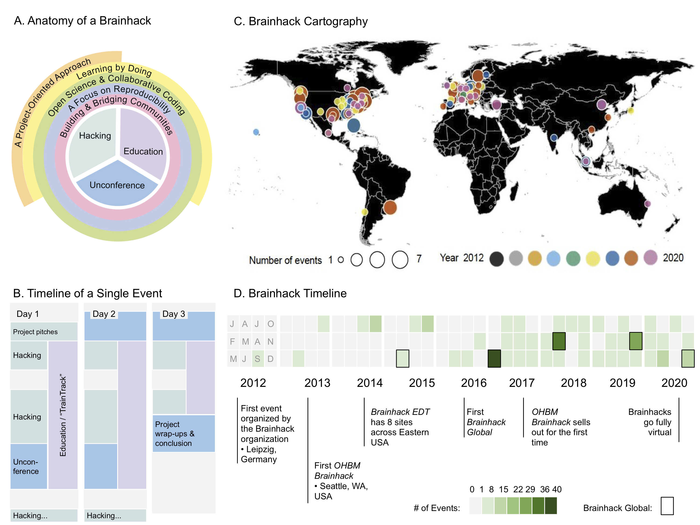

# Preprint Manuscript

## Brainhack: developing a culture of open, inclusive, community-driven neuroscience

*Note: This is a version for community review on psyarxiv and does not constitute the final version of the manuscript.*

[Authors & Affiliations TBD]

## Abstract

Brainhack is an innovative meeting format that promotes scientific collaboration and education in an open and inclusive environment. Departing from the formats of typical scientific workshops, these events are based on grassroots projects and training, and foster open and reproducible scientific practices. We describe here the multifaceted, lasting benefits of Brainhacks for individual participants, particularly early career researchers. We further highlight the unique contributions that Brainhacks can make to the research community, contributing to  scientific progress by complementing opportunities available in conventional formats.

**Keywords**: best practices, Brainhack, collaboration, community building, hackathon,  inclusivity, neuroscience, open science, reproducibility, training

**Discipline**: Life-science, Meta-science, Neuroscience (Cognitive Neuroscience, Computational Neuroscience, Systems Neuroscience, Other Neuroscience and Neurobiology)

## Conflict of Interest Statement

The Conflict of Interest (COI) assertion is made on behalf of all the authors listed for this preprint. COIs include: financial involvement in any entity such as honoraria, grants, speaking fees, employment, consultancies, stock ownership, expert testimony, and patents or licenses. COIs can also include non-financial interests such as personal or professional relationships or pre-existing beliefs in the subject matter or materials discussed in this preprint.

## Introduction

Social factors play a crucial role in the advancement of science. New findings are discussed and theories emerge through social interactions, which largely take place in individual research groups, and at academic events such as conferences, seminars or workshops. This system tends to amplify the voices of a select subset of the community—especially more established researchers—thus limiting opportunities for the larger community to contribute and connect. [Brainhack](https://brainhack.org) events (or Brainhacks for short) complement these formats in neuroscience with decentralized gatherings in which participants from all backgrounds and career stages collaborate and learn from each other in an informal setting. The Brainhack format was introduced in a previous publication ([Craddock et al., 2016;](#references) [Fig. 1A&B](#figure-1)). It is inspired by the [**hackathon**](./glossary) model (see Glossary), which originated in software development and has gained traction in science as a way to bring people together for collaborative work and educational courses. Unlike many hackathons, Brainhacks welcome participants from all disciplines and with any level of experience—from those who have never written a line of code to software developers and expert neuroscientists. Brainhacks additionally feature informal dissemination of research through [**unconferences**](./glossary), and replace the sometimes competitive context of traditional hackathons with a purely collaborative one. 

*Figure 1. Brainhack in time and space.*  (A) Anatomy of a Brainhack shows how the components of Brainhack events relate to overarching topics that lead to scientific and professional opportunities in neuroscience. (B) Timeline of a Single Event describes the typical daily schedule throughout a brainhack. Project work and educational activities occur simultaneously interspersed with unconferences. (C) Brainhack Cartography displays cities across the world that have hosted a Brainhack. Marker color indicates the year in which each city hosted its first Brainhack, and marker size indicates the number of events hosted in each city. (D) The Brainhack Timeline displays the number of events per month since the inaugural Brainhack in September 2012, along with notable happenings throughout the years. Months are only denoted in the first year with a single letter; this ordering is repeated for all subsequent years.

In the following, we aim to address two key questions about the merits of a Brainhack. First, how do participants benefit from attending a Brainhack? Second, what is the relevance and importance of Brainhacks for neuroscience more broadly?  To answer these questions, we discuss how Brainhacks feature 1) a [_Project-Oriented Approach_](#a-project-oriented-approach) that fosters active participation and community-driven problem-solving; 2) [_Learning By Doing_](#learning-by-doing), which enables participants to gain more intensive training, particularly in computational methods commonly featured at Brainhacks; 3) training in [_Open Science & Collaborative Coding_](#open-science-collaborative-coding) which helps participants become more effective collaborators across contexts; 4) [_A Focus on Reproducibility_](#a-focus-on-reproducibility) which leads to more robust scientific research; and 5) accelerated [_Building and Bridging of Communities_](#building-and-bridging-communities) which encourages inclusivity and seamless collaboration between researchers at different career stages. Altogether, Brainhacks and similar formats are increasingly recognized as a new way of doing science that extends traditional academic settings. These events foster a new research culture that demands [**open science**](./glossary) and celebrates diversity, unlocking opportunities for scientific progress.

## A Project-Oriented Approach

Brainhacks are fundamentally centered around attendee-led projects. At the beginning of each Brainhack, participants pitch project ideas and form teams to realize some of these ideas during the “hacking” sessions ([Fig. 1B](#figure-1)). The teams are dynamic, and their composition can change throughout the course of a project. As participants group themselves based on their common interest in a question, method or idea, interdisciplinary teams naturally emerge. Each participant can hone diverse skills by being an active part in multiple projects of interest. This is in contrast to the scientific silos that often arise when scientists connect over a specific methodological or conceptual approach. Brainhack projects promote the flow of information between specialized domains within the multidisciplinary field of neuroscience.
The project-oriented structure of Brainhack enables everyone to be an active participant at the event, with contributions taking a variety of forms. Importantly, the term “hacking” is not used to refer to coding in particular, but to describe an intensive form of work, eschewing strict conventions, and often targeted at prototyping an idea within a short period of time. Participants are therefore not required to have coding skills in order to make meaningful contributions. An example of an impactful project that did not focus on coding is [Open Brain Consent](https://open-brain-consent.readthedocs.io/en/stable) ([Bannier et al., 2020](#references)). This project has developed consent form templates for the collection and sharing of human neuroimaging data, incorporating data protection standards such as the General Data Protection Regulation (GDPR) of the European Union. The consent forms can be used in ethics approval procedures to ensure that the collected data is shareable, while the participants’ privacy is protected.

Unlike some traditional hackathons, there is no competitive element to Brainhacks. The focus is on collective and community-driven work, making the events more welcoming for inexperienced participants. Neither the level of completeness nor the publication potential determine the success of a project. Instead, Brainhacks emphasize the value of collaborating, exploring unconventional ideas, group thinking and building tools that benefit the community. Exemplary of these values is a project that originated at the very first Brainhack in 2012: The [Brain Catalogue](https://braincatalogue.org) provides magnetic resonance (MR) brain images of a range of different species and allows multiple users to view and segment them on the web simultaneously. Its successor, [BrainBox](https://brainbox.pasteur.fr) has evolved to enable real-time collaborative segmentation of any MR image accessible online ([Heuer et al., 2016](#references)). BrainBox has been used in many Brainhack projects, research collaborations and science outreach events. Similarly, [braindr](https://braindr.us/) fosters citizen science while solving the problem of visual quality control for massive datasets ([Keshavan et al., 2019](#references)). This app enables anyone to contribute to scientific progress by swiping left or right on brain images to classify them as clean or corrupted. The project originated from a hackathon in 2017, was extended in a Brainhack project in 2018, and recently led to the development of the extensible [SwipesforScience](https://swipesforscience.org)  citizen science template.

Many Brainhack projects take on a life of their own and grow beyond a single event. The open science approach embraced by the Brainhack community makes it easier for anyone to contribute to, or take the lead in pushing projects forward beyond their initial creation. For example, the [Autism Gradients](https://github.com/rb643/Autism-Gradients) project, exploring the cortical hierarchy in individuals with autism, was conceptualised at Brainhack Global 2016. It was subsequently picked up by another group who significantly extended the original idea and invited the initial Brainhack team to collaborate on it. This resulted in a peer-reviewed publication ([Hong et al., 2019](#references)), multiple follow-up projects, two exchange grants and several international workshops on the same topic. Another example is the development of [Nighres](https://nighres.readthedocs.io/en/latest), a Python package for processing high-resolution neuroimaging data. The initial project spanned two Brainhacks in 2016, and resulted in a [toolbox](https://github.com/juhuntenburg/laminar_python) that made algorithms for layer-specific analysis of the cortex easier to install and use. This sparked the development of the full Nighres package, with a broader range of functions and various contributors across several Brainhacks. Nighres has been presented in a peer-reviewed publication ([Huntenburg et al., 2018](#references)), is actively maintained, and has been used and cited in multiple studies.

These examples highlight how the project-oriented approach of Brainhacks encourages active participation, and interdisciplinary collaboration that can reach beyond a single event. The projects directly benefit the participants, who can explore new ideas in a stimulating setting, leverage their projects for career advancement and gain new skills. Brainhack projects also contribute to the progress of the wider neuroscience community by fostering exchange between scientific silos, resulting in multi-disciplinary tools, community-driven guidelines and reference data, as well as traditional publication output.

## Learning by Doing

Alongside projects, educational activities lie at the heart of Brainhack events. Such activities include informal teaching between project teammates, theoretical discussions in self-organized groups, “unconference” presentations, and structured workshops on a particular tool or topic. A recent format for major Brainhack events is the [**TrainTrack**](./glossary), entirely education-focused sessions that run all day, in parallel with work on projects ([Fig. 1A-B](#figure-1)). This format lowers the entry barrier for new participants, enabling them to build relevant skills and familiarize themselves with the structure and environment of a Brainhack before diving into their first project. The variety of educational approaches supports different learning styles. Furthermore, the informal nature of these activities empowers participants to be proactive about learning and asking for help.

Brainhack instructors strive to share their produced materials with the scientific community, including recorded presentations, slide decks, interactive tutorials, and more. For example, all the materials developed for the [TrainTrack of OHBM Brainhack 2020](https://ohbm.github.io/hackathon2020/traintrack/) have been made publically available so as to encourage reuse, redistribution, and reproduction of the content. Educational content developed for Brainhacks cover a range of topics including analytical and statistical methods (e.g., machine learning, data preprocessing), reproducible workflows (e.g., automated pipelines, automated data standardization, software containers), and other relevant concepts (e.g., preregistration, p-hacking). Many featured tools are geared towards promoting more open and reproducible practices. The training sessions are designed to be hands-on and interactive as they typically feature small groups having active discussions. Participants are explicitly encouraged to adopt what they learned at a Brainhack event to their own context and to improve the teaching material with their own ideas.

Skills learned at Brainhacks are not constrained to those of a technical nature; the event format provides a unique and safe opportunity for early career researchers to develop their teamwork and leadership skills. Project teams are often interdisciplinary, allowing participants to practice communicating beyond their own field. Everyone is encouraged to propose and lead their own projects, and the informal structure of the events often empowers more junior participants to also take on a leadership role. The growing pool of training materials provides a ready route to extend teaching opportunities to any member of the community, including trainees. Such experiences are rare for junior researchers, but crucial for their advancement. Altogether, the broad range of scientific and professional training opportunities equips participants with a skill set which is applicable across many domains and may therefore open up a greater range of career opportunities.

## Open Science & Collaborative Coding

Despite the increasingly central role of programming in neuroscience research, formal training in coding is not common in the neuroscience curriculum. In addition, code is seldomly shared across more than a few labs, and too often seen and used by only a single individual. As a result, many scripts and workflows are hard to reuse and share, and can contain undiscovered errors ([Merali et al., 2010](#references)).

By putting cross-disciplinary collaboration at its heart, Brainhacks have brought awareness to the need for the usability, reusability and long-term maintenance of tools. This comes with a shift of efforts, from individuals creating tools for their own needs to a community actively contributing to an existing resource, solving the aforementioned issues. Practices such as writing good code and documentation, improving code readability, performing basic version control, working collaboratively on a code base on GitHub, GitLab, or BitBucket, and using appropriate open licences have become essential within the community. These open practices and tools facilitate community-driven development and ensure that tools are available to all researchers, fostering global inclusivity. Brainhacks have also highlighted the importance of a variety of “research objects'' other than scientific papers (such as software, tutorials, workflows, and datasets), a concept that is increasingly endorsed by publishing venues such as F1000, RIO, eLife, Aperture, and others over the years.

Mastering collaborative programming skills enables Brainhack participants to contribute to open research objects which impact the wider scientific community. It can also make them more efficient at conducting their own research, for example when skills like version control are transferred to their own research group and foster more seamless collaboration amongst lab members. The wider neuroscience community benefits from the creation of transparent, reproducible toolsets, and from researchers equipped with the skills to maintain and extend them.

## A Focus on Reproducibility
In line with their open, transparent and collaborative nature, Brainhacks have fostered an increased awareness of the importance of reproducible practices that integrate easily into research workflows. In addition to the coding practices mentioned above, an important aspect of reproducibility is data sharing. Public datasets feature extensively in Brainhack projects and training sessions, since they are ideal for testing out new ideas or learning how to use a new tool. First-time users thus experiment with these datasets and related tools under the guidance of expert users, which lowers the barrier to working with public data in the future. This approach establishes open data sharing as a standard practice and teaches participants how to curate their data and metadata in a way that will be accessible and reusable by others.

Resources that help researchers handle their data in a reproducible fashion are integral to Brainhacks; many of these have been introduced to the Brainhack community through structured efforts from the Center for Reproducible Neuroimaging Computation ([Kennedy et al., 2019](#references)). For example, many projects and trainings use [DataLad](https://www.datalad.org), a tool that not only lets participants version-control their own data, but also helps them find, access, share, and work with increasingly large publicly available datasets. Similarly, a growing number of projects build on the [Brain Imaging Data Structure (BIDS](https://bids.neuroimaging.io), [Gorgolewski et al., 2016](#references)), a community standard for the organization of brain imaging data and metadata founded at the International Neuroinformatics Coordinating Facility (INCF). Introducing participants to data standards, such as BIDS, in the environment of a Brainhack allows them to experience the benefits of a unified data organisation and provides them with the skillset to use these formats in their own research. By creating a scientific culture around open and standardized data, metadata, and methods, as well as detailed documentation and reporting, Brainhacks promote fundamental building blocks of a more efficient and reliable scientific research process.

## Building and Bridging Communities

All aspects of Brainhacks discussed above build upon an active commitment to a diverse, inclusive, and non-hierarchically organized community. This commitment has been formalized in a Code of Conduct that aims to ensure a safe and welcoming environment for participants from all backgrounds. The [Code of Conduct](https://brainhack.org/code-of-conduct.html#:~:text=Brainhack%20is%20dedicated%20to%20providing,event%20participants%20in%20any%20form.) is discussed at the beginning of a Brainhack and adherence is monitored throughout the event. While far from perfect or bias-free, we are pleased to witness that the Brainhack community is continuously growing more diverse in terms of race, gender, sexual orientation, career stage, and more. The enthusiastically inclusive culture helps members hold each other to a standard of mutual respect that empowers individuals from typically underrepresented groups to claim their space and take on central roles in the community.

Brainhacks are designed to promote intensive networking. The project-oriented and decentralized setting puts participants on an equal footing regardless of backgrounds and career stage. Unconferences provide a unique opportunity for people interested in the same topic to meet and discuss, sometimes sparking new collaborations. Working in small groups during projects, workshops, and unconferences over the course of several days encourages frequent interactions that often go deeper than relatively short encounters at traditional conferences. These interactions frequently lead to lasting collaborations that bridge across disciplines, research contexts, career stages, and geographical areas. Sometimes they lead to job opportunities. Often they turn into friendships. We firmly believe that growing this diverse community and insisting on a culture of collaboration and inclusivity has untold benefits for the retention and well-being of all scientists doing brain research.

The general format of project-oriented, community-building events has gained traction in the field of neuroscience and beyond. Brainhack Global is our major yearly event that has sparked numerous simultaneous events around the world since 2012; the focus on open collaboration through virtual spaces throughout the years meant that when events were compelled to go virtual in 2020, the community had the infrastructure and knowledge to readily organize and attend virtual events around the world. Large initiatives such as the [Human Brain Project](https://www.humanbrainproject.eu/en/education/participatecollaborate/infrastructure-events-trainings),  [Neurodata Without Borders](https://neurodatawithoutborders.github.io/nwb_hackathons), and the [Society for the Improvement of Psychological Science](http://improvingpsych.org) have also chosen hackathons as a primary work format. Summer schools like the [ABCD-ReproNim](https://www.abcd-repronim.org/index.html) course, [NeuroHackademy](https://neurohackademy.org/), and the [Brainhack School](https://Brainhackmtl.github.io/) are based on the same principles as the original Brainhack events. Thus, a strong ecosystem has emerged that transports the benefits and values of the format far beyond any individual event. Brainhacks are spreading to an increasingly wide community, as the non-hierarchical, self-organising structure enables individuals to organize a Brainhack anywhere in the world ([Fig. 1C](#figure-1)) and events are kept financially accessible. An online community with over 4000 members and 500 channels uses the [Mattermost](https://mattermost.brainhack.org) messaging platform to provide continuity across time and space. Posts range from questions about a specific resource, to job openings and discussions about research ethics; and anyone can join regardless of having attended a Brainhack. The community evolves with every new member and their ideas, and many members become local advocates for the principles of open and collaborative science in their home institutions.

## Conclusion & Future Directions
Brainhacks complement traditional academic settings and offer additional opportunities for participants to achieve their scientific and professional goals. The focus on building a community that promotes open science and inclusivity has naturally led to better coding practices, more reproducible methods, and ample opportunities for collaboration. Brainhacks differ from many  scientific meetings, as they are more project-oriented, less formal and less directed at producing and broadcasting publications. Within neuroscience, Brainhacks have the potential to evolve beyond their initial focus on neuroimaging data and include more projects on theory, hardware, and different types of neural data. With a growing global community, and an iteratively improving format ([Fig. 1D](#figure-1)), Brainhacks provide a successful template that can easily be extended to other scientific fields. A near decade of Brainhacks has brought about positive change for individual researchers and the field as a whole, in the form of improved skills, reusable resources, new collaborations and a diverse and inclusive community.

## Acknowledgments

[View acknowledgments here](/preprint_acknowledgments)

## Author Contributions

[View contributions here](/preprint_contributors)

## References
Bannier, E., Barker, G., Borghesani, V., Broeckx, N., Clement, P., de la Iglesia Vaya, M., Emblem, K. E., Ghosh, S. S., Glerean, E., Gorgolewski, K. J., Havu, M., Halchenko, Y. O., Herholz, P., Hespel, A., Heunis, S., Hu, Y., Chuan-Peng, H., Huijser, D., Jancalek, R., … Zhu, H. (2020). The Open Brain Consent: Informing research participants and obtaining consent to share brain imaging data. Center for Open Science. https://doi.org/10.31234/osf.io/f6mnp

Craddock, R. C., Margulies, D. S., Bellec, P., Nichols, B. N., Alcauter, S., Barrios, F. A., Burnod, Y., Cannistraci, C. J., Cohen-Adad, J., De Leener, B., Dery, S., Downar, J., Dunlop, K., Franco, A. R., Froehlich, C. S., Gerber, A. J., Ghosh, S. S., Grabowski, T. J., Hill, S., … Xu, T. (2016). Brainhack: a collaborative workshop for the open neuroscience community. GigaScience, 5(1). https://doi.org/10.1186/s13742-016-0121-x.

Gorgolewski, K. J., Auer, T., Calhoun, V. D., Craddock, R. C., Das, S., Duff, E. P., Flandin, G., Ghosh, S. S., Glatard, T., Halchenko, Y. O., Handwerker, D. A., Hanke, M., Keator, D., Li, X., Michael, Z., Maumet, C., Nichols, B. N., Nichols, T. E., Pellman, J., … Poldrack, R. A. (2016). The brain imaging data structure, a format for organizing and describing outputs of neuroimaging experiments. Scientific Data, 3(1). https://doi.org/10.1038/sdata.2016.44.

Heuer, K., Ghosh, S., Robinson Sterling, A., & Toro, R. (2016). Open Neuroimaging Laboratory. Research Ideas and Outcomes 2: e9113. https://doi.org/10.3897/rio.2.e9113

Hong, S.-J., Vos de Wael, R., Bethlehem, R. A. I., Lariviere, S., Paquola, C., Valk, S. L., Milham, M. P., Di Martino, A., Margulies, D. S., Smallwood, J., & Bernhardt, B. C. (2019). Atypical functional connectome hierarchy in autism. Nature Communications, 10(1). https://doi.org/10.1038/s41467-019-08944-1

Huntenburg, J. M., Steele, C. J., & Bazin, P.-L. (2018). Nighres: processing tools for high-resolution neuroimaging. GigaScience, 7(7). https://doi.org/10.1093/gigascience/giy082

Kennedy, D. N., Abraham, S. A., Bates, J. F., Crowley, A., Ghosh, S., Gillespie, T., Goncalves, M., Grethe, J. S., Halchenko, Y. O., Hanke, M., Haselgrove, C., Hodge, S. M., Jarecka, D., Kaczmarzyk, J., Keator, D. B., Meyer, K., Martone, M. E., Padhy, S., Poline, J.-B., … Travers, M. (2019). Everything Matters: The ReproNim Perspective on Reproducible Neuroimaging. Frontiers in Neuroinformatics, 13. https://doi.org/10.3389/fninf.2019.00001

Keshavan, A., Yeatman, J. D., & Rokem, A. (2019). Combining Citizen Science and Deep Learning to Amplify Expertise in Neuroimaging. Frontiers in Neuroinformatics, 13. https://doi.org/10.3389/fninf.2019.00029

Merali, Z. Computational science: ...Error. Nature 467, 775-777 (2010) | doi:10.1038/467775a.)https://www.nature.com/news/2010/101013/full/467775a.html
